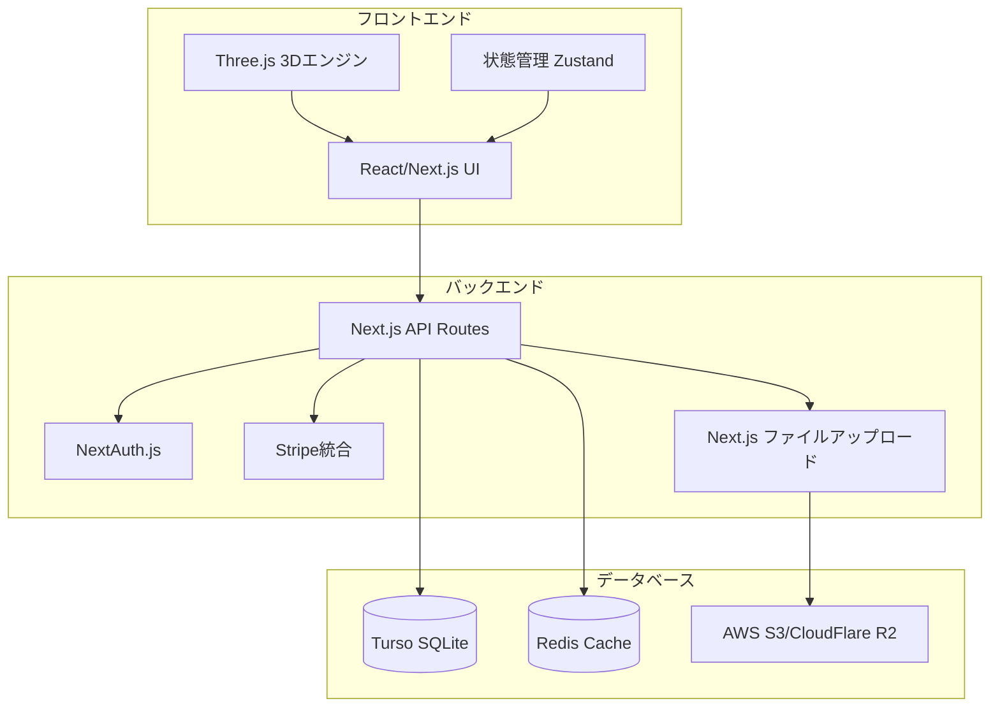

# 設計文書

## 概要

Cardyは、3D表示機能を持つデジタルカード管理プラットフォームです。ユーザーがオリジナルカードを作成・販売し、希少価値のあるデジタルコレクションを構築できるWebアプリケーションとして設計されています。

## アーキテクチャ

### システム全体構成



### 技術スタック

**フロントエンド:**
- Next.js 14 (App Router)
- React 18
- TypeScript
- Three.js (3Dカード表示)
- React Three Fiber (React + Three.js統合)
- Tailwind CSS (スタイリング)
- Zustand (状態管理)
- React Hook Form (フォーム管理)

**バックエンド:**
- Next.js API Routes (フルスタック構成)
- TypeScript
- Prisma ORM (Turso対応)
- NextAuth.js (認証)
- Stripe (決済処理)
- 組み込みファイルアップロード

**データベース・ストレージ:**
- Turso (SQLiteベースのエッジデータベース)
- Redis (セッション・キャッシュ)
- AWS S3 または Cloudflare R2 (画像ストレージ)

## コンポーネントとインターフェース

### フロントエンドコンポーネント

#### 3Dカード表示コンポーネント
```typescript
interface Card3DProps {
  frontImage: string;
  backImage: string;
  cardData: CardData;
  interactive?: boolean;
  onCardClick?: (cardId: string) => void;
}

interface CardData {
  id: string;
  name: string;
  description: string;
  rarity: 'common' | 'rare' | 'epic' | 'legendary';
  totalSupply: number;
  remainingSupply: number;
}
```

#### カード作成フォーム
```typescript
interface CardCreationForm {
  name: string;
  description: string;
  frontImage: File;
  backImage: File;
  price: number;
  totalSupply: number;
  category: string;
}
```

#### カードセット管理
```typescript
interface CardSet {
  id: string;
  name: string;
  description: string;
  cards: CardData[];
  price: number;
  totalSupply: number;
  remainingSupply: number;
}
```

### バックエンドAPI設計

#### カード管理API
```typescript
// GET /api/cards - カード一覧取得
// POST /api/cards - カード作成
// GET /api/cards/:id - カード詳細取得
// PUT /api/cards/:id - カード更新
// DELETE /api/cards/:id - カード削除

interface CreateCardRequest {
  name: string;
  description: string;
  frontImageUrl: string;
  backImageUrl: string;
  price: number;
  totalSupply: number;
  category: string;
}

interface CardResponse {
  id: string;
  name: string;
  description: string;
  frontImageUrl: string;
  backImageUrl: string;
  price: number;
  totalSupply: number;
  remainingSupply: number;
  creatorId: string;
  createdAt: string;
  updatedAt: string;
}
```

#### セット管理API
```typescript
// GET /api/sets - セット一覧取得
// POST /api/sets - セット作成
// GET /api/sets/:id - セット詳細取得
// PUT /api/sets/:id - セット更新
// DELETE /api/sets/:id - セット削除
// PUT /api/sets/:id/inventory - セット在庫数更新

interface CreateSetRequest {
  name: string;
  description: string;
  cardIds: string[];
  price: number;
  totalSupply: number; // 販売上限（在庫数）
}

interface SetInventoryUpdate {
  totalSupply: number;
  remainingSupply: number;
}

interface SetResponse {
  id: string;
  name: string;
  description: string;
  cards: CardData[];
  price: number;
  totalSupply: number; // 設定された販売上限
  remainingSupply: number; // 残り在庫数
  soldCount: number; // 販売済み数
  creatorId: string;
  createdAt: string;
  updatedAt: string;
}
```

#### 購入・所有権API
```typescript
// POST /api/purchase/card/:id - カード購入
// POST /api/purchase/set/:id - セット購入
// GET /api/collection - ユーザーのコレクション取得

interface PurchaseRequest {
  paymentMethodId: string;
}

interface CollectionResponse {
  ownedCards: OwnedCard[];
  ownedSets: OwnedSet[];
  totalValue: number;
}
```

## データモデル

### データベーススキーマ (Turso SQLite)

```sql
-- ユーザーテーブル
CREATE TABLE users (
  id TEXT PRIMARY KEY DEFAULT (lower(hex(randomblob(16)))),
  email TEXT UNIQUE NOT NULL,
  username TEXT UNIQUE NOT NULL,
  password_hash TEXT NOT NULL,
  profile_image_url TEXT,
  created_at DATETIME DEFAULT CURRENT_TIMESTAMP,
  updated_at DATETIME DEFAULT CURRENT_TIMESTAMP
);

-- カードテーブル
CREATE TABLE cards (
  id TEXT PRIMARY KEY DEFAULT (lower(hex(randomblob(16)))),
  name TEXT NOT NULL,
  description TEXT,
  front_image_url TEXT NOT NULL,
  back_image_url TEXT NOT NULL,
  price REAL NOT NULL,
  total_supply INTEGER NOT NULL,
  remaining_supply INTEGER NOT NULL,
  category TEXT,
  creator_id TEXT REFERENCES users(id),
  created_at DATETIME DEFAULT CURRENT_TIMESTAMP,
  updated_at DATETIME DEFAULT CURRENT_TIMESTAMP
);

-- カードセットテーブル
CREATE TABLE card_sets (
  id TEXT PRIMARY KEY DEFAULT (lower(hex(randomblob(16)))),
  name TEXT NOT NULL,
  description TEXT,
  price REAL NOT NULL,
  total_supply INTEGER NOT NULL, -- 販売上限（在庫数）
  remaining_supply INTEGER NOT NULL, -- 残り在庫数
  sold_count INTEGER DEFAULT 0, -- 販売済み数
  creator_id TEXT REFERENCES users(id),
  created_at DATETIME DEFAULT CURRENT_TIMESTAMP,
  updated_at DATETIME DEFAULT CURRENT_TIMESTAMP,
  
  -- 在庫整合性チェック
  CHECK (remaining_supply >= 0 AND sold_count >= 0 AND 
         remaining_supply + sold_count = total_supply)
);

-- セット内カード関連テーブル
CREATE TABLE set_cards (
  set_id TEXT REFERENCES card_sets(id) ON DELETE CASCADE,
  card_id TEXT REFERENCES cards(id) ON DELETE CASCADE,
  PRIMARY KEY (set_id, card_id)
);

-- カード所有権テーブル
CREATE TABLE card_ownership (
  id TEXT PRIMARY KEY DEFAULT (lower(hex(randomblob(16)))),
  user_id TEXT REFERENCES users(id),
  card_id TEXT REFERENCES cards(id),
  purchase_price REAL NOT NULL,
  purchased_at DATETIME DEFAULT CURRENT_TIMESTAMP,
  UNIQUE(user_id, card_id)
);

-- セット所有権テーブル
CREATE TABLE set_ownership (
  id TEXT PRIMARY KEY DEFAULT (lower(hex(randomblob(16)))),
  user_id TEXT REFERENCES users(id),
  set_id TEXT REFERENCES card_sets(id),
  purchase_price REAL NOT NULL,
  purchased_at DATETIME DEFAULT CURRENT_TIMESTAMP,
  UNIQUE(user_id, set_id)
);

-- 取引履歴テーブル
CREATE TABLE transactions (
  id TEXT PRIMARY KEY DEFAULT (lower(hex(randomblob(16)))),
  buyer_id TEXT REFERENCES users(id),
  seller_id TEXT REFERENCES users(id),
  item_type TEXT NOT NULL, -- 'card' or 'set'
  item_id TEXT NOT NULL,
  amount REAL NOT NULL,
  stripe_payment_intent_id TEXT,
  status TEXT DEFAULT 'pending',
  created_at DATETIME DEFAULT CURRENT_TIMESTAMP
);

-- インデックス作成
CREATE INDEX idx_cards_creator ON cards(creator_id);
CREATE INDEX idx_cards_category ON cards(category);
CREATE INDEX idx_card_sets_creator ON card_sets(creator_id);
CREATE INDEX idx_card_ownership_user ON card_ownership(user_id);
CREATE INDEX idx_set_ownership_user ON set_ownership(user_id);
CREATE INDEX idx_transactions_buyer ON transactions(buyer_id);
CREATE INDEX idx_transactions_seller ON transactions(seller_id);
```

## エラーハンドリング

### フロントエンドエラーハンドリング
- React Error Boundary による予期しないエラーのキャッチ
- API呼び出し失敗時のリトライ機構
- 3D表示エラー時のフォールバック表示
- ファイルアップロード失敗時の再試行機能

### バックエンドエラーハンドリング
```typescript
interface APIError {
  code: string;
  message: string;
  details?: any;
}

// エラーコード定義
enum ErrorCodes {
  CARD_NOT_FOUND = 'CARD_NOT_FOUND',
  INSUFFICIENT_SUPPLY = 'INSUFFICIENT_SUPPLY',
  PAYMENT_FAILED = 'PAYMENT_FAILED',
  UNAUTHORIZED = 'UNAUTHORIZED',
  VALIDATION_ERROR = 'VALIDATION_ERROR'
}
```

### 決済エラーハンドリング
- Stripe決済失敗時の在庫復元
- 重複購入防止機構
- 決済タイムアウト処理

## テスト戦略

### フロントエンドテスト
- **単体テスト**: Jest + React Testing Library
  - コンポーネントの描画テスト
  - ユーザーインタラクションテスト
  - 3Dカード表示の基本機能テスト
- **統合テスト**: Cypress
  - カード作成フローのE2Eテスト
  - 購入フローのE2Eテスト
  - 3Dカード操作のテスト

### バックエンドテスト
- **単体テスト**: Jest
  - API エンドポイントのテスト
  - データベース操作のテスト
  - 認証・認可のテスト
- **統合テスト**: Supertest
  - API全体のフローテスト
  - 決済処理のテスト
  - ファイルアップロードのテスト

### パフォーマンステスト
- 3D表示のフレームレート測定
- 大量カード表示時の性能テスト
- 同時購入処理の負荷テスト

## セキュリティ考慮事項

### 認証・認可
- JWT トークンベース認証
- リフレッシュトークン機構
- RBAC (Role-Based Access Control)

### データ保護
- パスワードのハッシュ化 (bcrypt)
- 機密データの暗号化
- HTTPS通信の強制

### 決済セキュリティ
- Stripe の PCI DSS 準拠
- 決済情報の非保存
- 不正取引検知

### ファイルアップロード
- ファイル形式の検証
- ファイルサイズ制限
- マルウェアスキャン
- 画像の自動最適化

## パフォーマンス最適化

### フロントエンド最適化

#### Three.js パフォーマンス最適化
- **軽量な3Dモデル**: シンプルなプレーン（平面）ジオメトリを使用してカードを表現
- **テクスチャ最適化**: 画像を適切なサイズ（512x512px等）にリサイズ・圧縮
- **インスタンス化**: 同じカード形状を使い回してメモリ使用量を削減
- **視錐台カリング**: 画面外のカードは描画をスキップ
- **LOD (Level of Detail)**: 距離に応じてカードの詳細度を調整
- **オブジェクトプール**: カードオブジェクトの再利用でGCを削減
- **レンダリング最適化**: requestAnimationFrameの適切な使用

#### UI/UX最適化
- **遅延読み込み**: スクロール時にカードを段階的に読み込み
- **仮想化**: 大量のカードリスト表示時の仮想スクロール
- **プリロード**: よく使用される画像の事前読み込み
- **フォールバック**: 3D表示に失敗した場合の2D表示切り替え

#### パフォーマンス監視
- **FPS監視**: 60FPSを維持するためのフレームレート監視
- **メモリ使用量**: Three.jsオブジェクトのメモリリーク防止
- **バンドルサイズ**: Three.jsの必要な機能のみをインポート

### バックエンド最適化
- データベースインデックスの最適化
- Redis キャッシュの活用
- API レスポンスの圧縮
- CDN による静的ファイル配信

### データベース最適化
- 適切なインデックス設計
- クエリの最適化
- 接続プールの設定
- 読み取り専用レプリカの活用